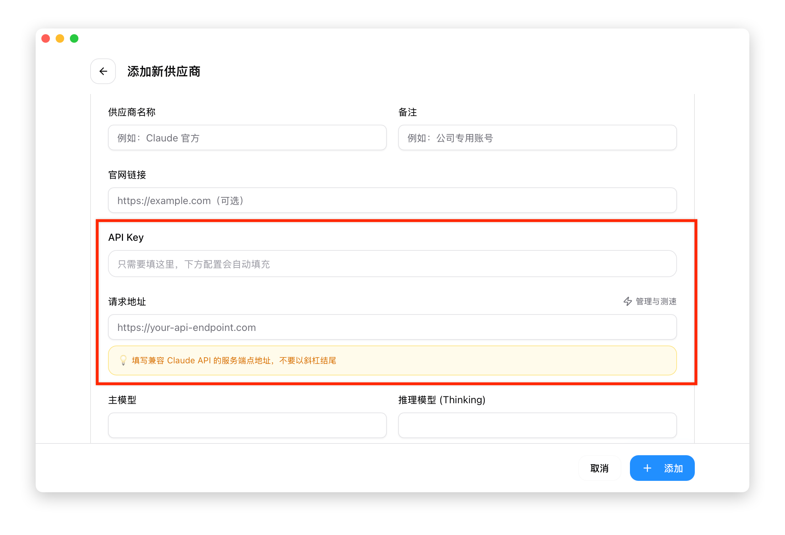
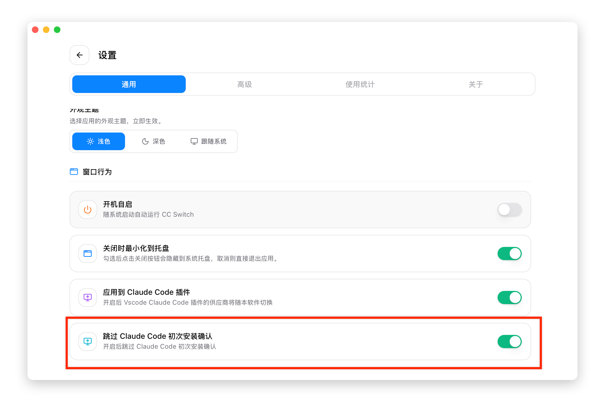

# 1.4 Quick Start

This section helps you complete the initial setup in 5 minutes.

## Step 1: Add a Provider

1. Click the **+** button in the top-right corner of the main interface
2. Select your provider from the "Preset" dropdown
   - Common presets: Zhipu GLM, MiniMax, DeepSeek, Kimi, PackyCode
   - Or select "Custom" for manual configuration
3. Enter your **API Key**
4. Click "Add"



> **Tip**: Presets auto-fill the endpoint URL, so you only need to enter your API Key.

## Step 2: Switch Provider

After adding, the provider appears in the list.

**Option 1: Switch from the main interface**
- Click the "Enable" button on the provider card

**Option 2: Quick switch via system tray**
- Right-click the CC Switch icon in the system tray
- Click the provider name directly

## Step 3: Activation

After switching providers, each CLI tool activates differently:

| Application | Activation Method |
|-------------|-------------------|
| Claude Code | Instant effect (supports hot reload) |
| Codex | Requires closing and reopening the terminal |
| Gemini | Instant effect (re-reads config on each request) |
| OpenCode | Requires closing and reopening the terminal |
| OpenClaw | Requires closing and reopening the terminal |

### Claude Code First Launch Prompt

If Claude Code prompts you to **log in** or shows an onboarding wizard on first launch, enable the "Skip Claude Code first-run confirmation" option in CC Switch:

1. Open CC Switch "Settings > General"
2. Enable the "Skip Claude Code first-run confirmation" toggle
3. Restart Claude Code



> **Note**: This option writes the `skipIntroduction` field to `~/.claude/settings.json`, skipping the official onboarding flow.

## Verify Configuration

After restarting, launch the corresponding CLI tool and enter a simple question to test:

```bash
# Claude Code - enter a test question after launching
claude
> Hello, please briefly introduce yourself

# Codex - enter a test question after launching
codex
> Hello, please briefly introduce yourself

# Gemini - enter a test question after launching
gemini
> Hello, please briefly introduce yourself

# OpenCode - enter a test question after launching
opencode
> Hello, please briefly introduce yourself

# OpenClaw - enter a test question after launching
openclaw
> Hello, please briefly introduce yourself
```

If the AI responds normally, the configuration is successful.

## Next Steps

Congratulations! You have completed the basic configuration. Next, you can:

- [Add more providers](../2-providers/2.1-add.md) - Configure multiple providers for easy switching
- [Configure MCP servers](../3-extensions/3.1-mcp.md) - Extend AI tool capabilities
- [Set up system prompts](../3-extensions/3.2-prompts.md) - Customize AI behavior
- [Enable proxy service](../4-proxy/4.1-service.md) - Monitor usage and enable automatic failover

## Common Issues

### Not taking effect after switching?

Make sure you restarted the terminal or CLI tool. The configuration file is updated at switch time, but running programs do not automatically reload it.

### Can't find a preset?

If your provider is not in the preset list, select "Custom" for manual configuration. See [Add Provider](../2-providers/2.1-add.md) for configuration format details.

### How to restore official login?

Select the "Official Login" preset (Claude/Codex) or "Google Official" preset (Gemini), restart the client, and follow the login flow.
