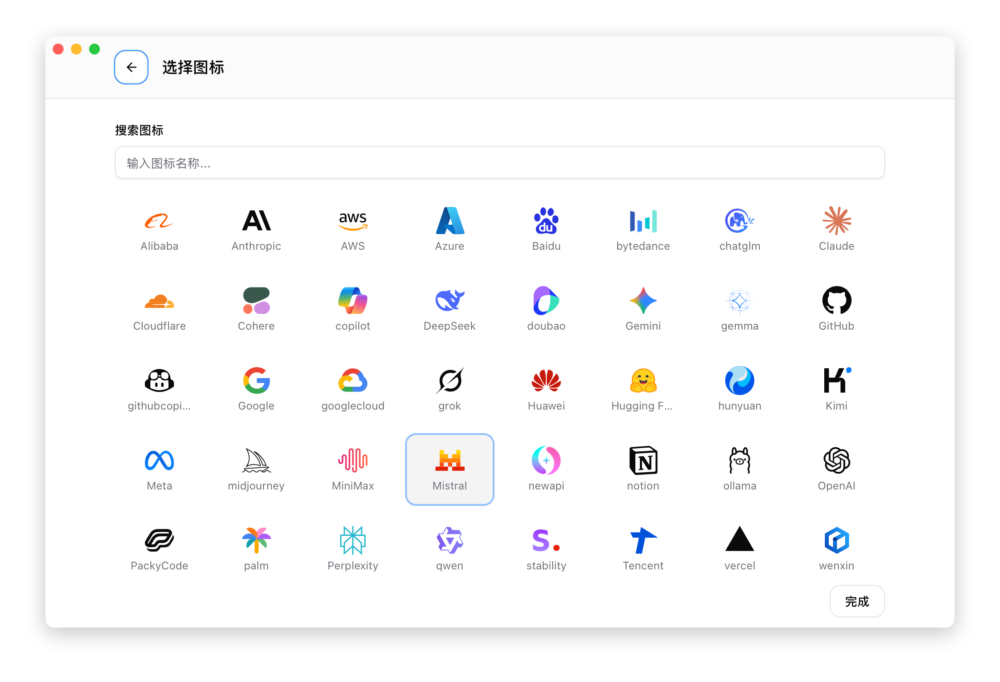

# 2.3 Edit Provider

## Open the Edit Panel

1. Find the provider card you want to edit
2. Hover over the card to reveal action buttons
3. Click the "Edit" button

## Editable Content

### Basic Information

| Field | Description |
|-------|-------------|
| Name | Provider display name |
| Notes | Additional notes |
| Website Link | Provider website or console URL |
| Icon | Custom icon and color |

### Icon Customization

CC Switch provides rich icon customization features:

#### Icon Picker

1. Click the icon area to open the icon picker
2. Use the search box to search icons by name
3. Click to select the desired icon

The icon library includes common AI service provider and technology icons, supporting:
- Fuzzy search by name
- Icon name tooltips
- Real-time preview of selected icon



### Configuration

JSON-formatted configuration content, including:

- API Key
- Endpoint URL
- Other environment variables

### Editing the Currently Active Provider

When editing the currently active provider, a special "backfill" mechanism applies:

1. When opening the edit panel, the latest content is read from the live configuration file
2. If you manually modified the configuration in the CLI tool, those changes are synced back
3. After saving, modifications are written to the live configuration file

This ensures CC Switch and CLI tool configurations stay in sync.

## Auto-Fetch Models

When editing a provider, you can auto-fetch the available model list from the provider's endpoint:

1. Ensure the API Key and endpoint URL are filled in
2. Click the **Fetch Models** button (download icon) next to the model input field
3. Select a model from the grouped dropdown

See [2.1 Add Provider — Auto-Fetch Models](./2.1-add.md#auto-fetch-models) for full details.

## Common Config Toggles (Claude)

When editing a Claude provider, quick toggle switches are available above the JSON editor for common settings like Tool Search, Disable Auto Upgrade, Teammates, and High Effort. See [2.1 Add Provider — Claude Common Config Toggles](./2.1-add.md#claude-common-config-toggles) for details.

## Modify API Key

When editing a provider, you can modify the key directly in the **API Key** input field:

1. Click the "Edit" button on the provider card
2. Enter the new key in the "API Key" input field
3. Click "Save"

> **Tip**: The API Key input field supports a show/hide toggle. Click the eye icon on the right to view the full key.

## Modify Endpoint URL

When editing a provider, you can modify the URL directly in the **Endpoint URL** input field:

1. Click the "Edit" button on the provider card
2. Enter the new URL in the "Endpoint URL" input field
3. Click "Save"

### Endpoint URL Format

| Application | Format Example |
|-------------|----------------|
| Claude | `https://api.example.com` |
| Codex | `https://api.example.com/v1` |
| Gemini | `https://api.example.com` |

## Add Custom Endpoints

Providers can be configured with multiple endpoints for:

- Testing multiple addresses during speed tests
- Backup endpoints for failover

### Auto-collection

When adding a provider, CC Switch automatically extracts endpoint URLs from the configuration.

### Manual Addition

When editing a provider, in the "Endpoint Management" area you can:

- Add new endpoints
- Delete existing endpoints
- Set a default endpoint

## JSON Editor

Configuration uses JSON format, and the editor provides:

- Syntax highlighting
- Format validation
- Error messages

### Common Errors

**Missing quotes**:
```json
// Wrong
{ env: { KEY: "value" } }

// Correct
{ "env": { "KEY": "value" } }
```

**Trailing comma**:
```json
// Wrong
{ "env": { "KEY": "value", } }

// Correct
{ "env": { "KEY": "value" } }
```

**Unclosed brackets**:
```json
// Wrong
{ "env": { "KEY": "value" }

// Correct
{ "env": { "KEY": "value" } }
```

## Save and Activate

1. Click the "Save" button
2. If the form detects a non-blocking issue, a "save anyway" prompt appears; confirming still saves the provider
3. If this is the currently active provider, the configuration is immediately written to the live file
4. Restart the CLI tool for changes to take effect

## Cancel Editing

Click "Cancel" or press the `Esc` key to close the edit panel. All modifications will be discarded.
