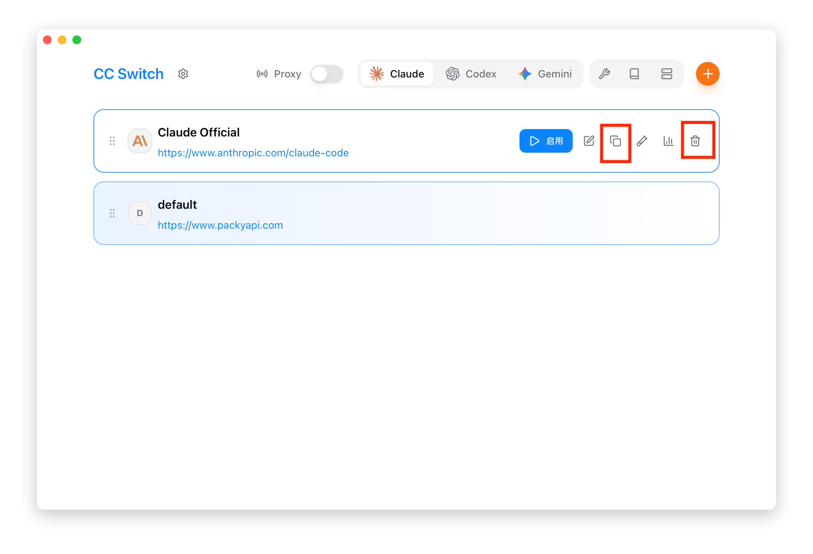

# 2.4 Sort & Duplicate

## Drag to Reorder

Adjust the display order of providers by dragging.

### Steps

1. Move the mouse to the **≡** drag handle on the left side of the provider card
2. Hold the left mouse button
3. Drag up or down to the target position
4. Release the mouse to complete reordering

### Reorder Uses

- **Prioritize frequently used**: Place frequently used providers at the top of the list
- **Failover order**: Sorting affects the default order of the failover queue

## Duplicate Provider

Quickly create a copy of a provider, useful for:

- Creating variations based on existing configurations
- Backing up current configurations
- Creating test configurations

Starting from v3.15.0, universal providers also have a duplicate action, so you can create a copy first and then adjust enabled apps and models.

### Steps

1. Hover over the provider card to reveal action buttons
2. Click the "Duplicate" button
3. A copy is automatically created with a `copy` name suffix
4. Edit the copy to modify the configuration

### Duplicated Content

Duplication creates a complete copy, including:

| Content | Duplicated |
|---------|------------|
| Name | Yes (with `copy` suffix) |
| Configuration | Fully duplicated |
| Notes | Yes |
| Website Link | Yes |
| Icon | Yes |
| Endpoint List | Yes |
| Sort Position | Inserted below the original provider |

### After Duplication

After duplication, you typically need to modify:

1. **Name**: Change to a meaningful name
2. **API Key**: If using a different account
3. **Endpoint**: If using a different service

## Delete Provider

### Steps

1. Hover over the provider card to reveal action buttons
2. Click the "Delete" button
3. Confirm deletion

### Deletion Confirmation

A confirmation dialog appears before deletion, showing:

- Provider name
- Warning that deletion cannot be undone

### Deletion Restrictions

- **Currently active provider**: Can be deleted, but it is recommended to switch to another provider first
- **Universal provider**: Deleting will also remove linked app configurations

