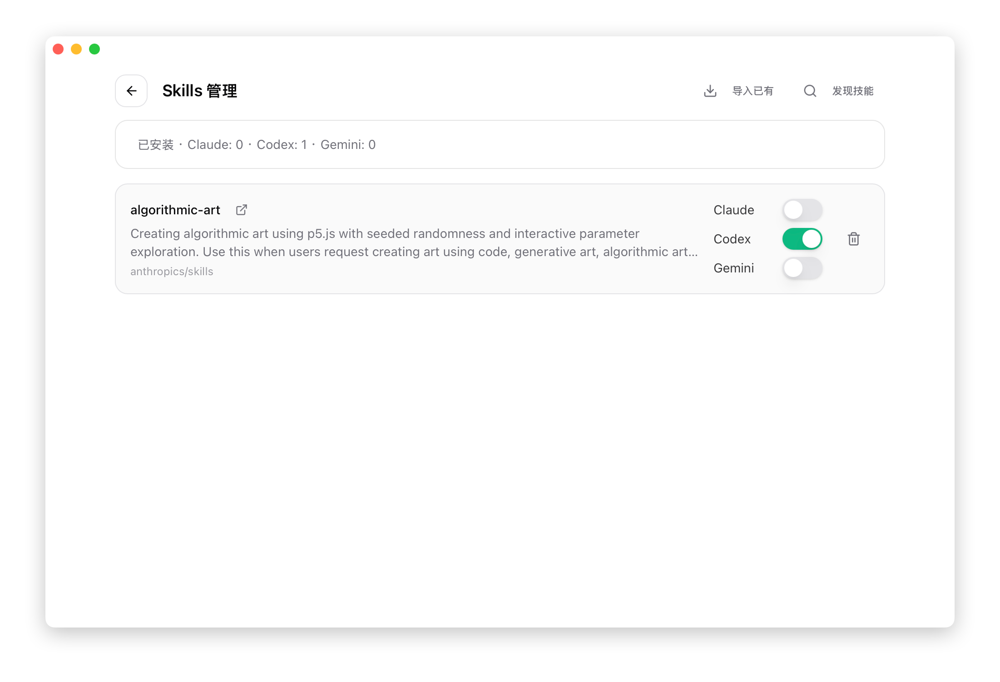
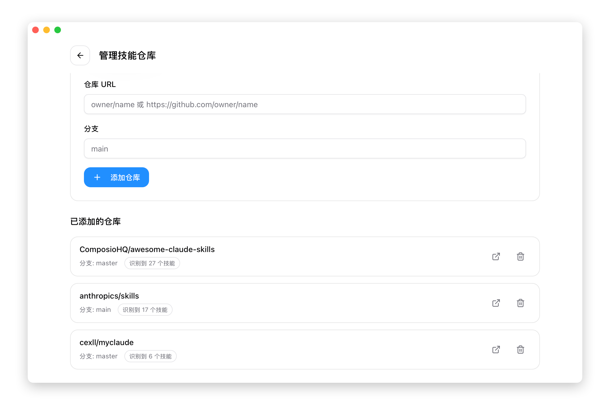

# 3.3 Skills Management

## Overview

Skills are reusable capability extensions that give AI tools specialized abilities in specific domains.

Skills exist as folders containing:

- Prompt templates
- Tool definitions
- Example code

## Supported Applications

Skills are supported across all four applications:

- **Claude Code**
- **Codex**
- **Gemini CLI**
- **OpenCode**

## Open the Skills Page

Click the **Skills** button in the top navigation bar.

> Note: The Skills button is visible in all app modes.

## Page Overview



## Discover Skills

### Pre-configured Repositories

CC Switch comes pre-configured with the following GitHub repositories:

| Repository | Description |
|------------|-------------|
| Anthropic Official | Official skills provided by Anthropic |
| ComposioHQ | Community-maintained skill collection |
| Community Picks | Curated high-quality skills |



### Search & Filter

CC Switch provides powerful search and filter features:

#### Search Box

- Search by skill name
- Search by skill description
- Search by directory name
- Real-time filtering, results update as you type

#### Status Filter

Use the dropdown menu to filter by installation status:

| Option | Description |
|--------|-------------|
| All | Show all skills |
| Installed | Show only installed skills |
| Not Installed | Show only uninstalled skills |


#### Combined Use

Search and filter can be combined:

- Select "Installed" filter first
- Then enter keywords to search
- Results show the match count

### Refresh List

Click the "Refresh" button to re-scan repositories for the latest skills.

## Install Skills

### Steps

1. Find the skill card you want to install
2. Click the "Install" button
3. Wait for installation to complete

### Installation Location

| Application | Install Directory |
|-------------|-------------------|
| Claude | `~/.claude/skills/` |
| Codex | `~/.codex/skills/` |
| Gemini | `~/.gemini/skills/` |
| OpenCode | `~/.opencode/skills/` |

### Installation Contents

Installation copies the skill folder to your local machine:

```
~/.claude/skills/
└── skill-name/
    ├── README.md
    ├── prompt.md
    └── tools/
        └── ...
```

## Uninstall Skills

### Steps

1. Find the installed skill card
2. Click the "Uninstall" button
3. Confirm uninstallation

### Uninstall Effect

- **Automatic backup**: Before deletion, the skill is backed up to `~/.cc-switch/skill-backups/`
- Removes the skill from all app directories (Claude, Codex, Gemini, OpenCode)
- Removes the skill from the SSOT directory (`~/.cc-switch/skills/`)
- Deletes the skill record from the database

### Restore from Backup

If you need to restore a previously uninstalled skill:

1. Open the Skills page
2. Click the **Restore from Backup** button
3. Select the backup you want to restore from the list (shows skill name and backup date)
4. The skill is restored and enabled for the current app

### Delete Backups

To remove old skill backups:

1. In the restore dialog, find the backup you want to remove
2. Click the **Delete** button next to the backup entry
3. Confirm deletion — this cannot be undone

## Repository Management

### Open Repository Management

Click the "Repository Management" button at the top of the page.

### Add Custom Repository

1. Click "Add Repository"
2. Fill in repository information:
   - Owner: GitHub username or organization name
   - Name: Repository name
   - Branch: Branch name (default: main)
   - Subdirectory: Subdirectory containing skills (optional)
3. Click "Add"

### Repository Format

```
https://github.com/{owner}/{name}/tree/{branch}/{subdirectory}
```

Example:

```
Owner: anthropics
Name: claude-skills
Branch: main
Subdirectory: skills
```

### Delete Repository

1. Find the repository in the repository list
2. Click the "Delete" button
3. Confirm deletion

After deleting a repository, its skills will not disappear from the list, but they can no longer be updated.

## Skill Card Information

Each skill card displays:

| Information | Description |
|-------------|-------------|
| Name | Skill name |
| Description | Function description |
| Source | Source repository |
| Status | Installed / Not Installed |

## Skill Updates

Starting from v3.13.0, Skills support **automatic update detection** and **batch updates** — no more uninstall-and-reinstall.

### Update Detection Mechanism

CC Switch compares installed skills with the remote repository version using **SHA-256 content hashes**. Whenever the remote has any content changes, the corresponding local skill card automatically shows an "Update available" indicator.

### Single Update

For a skill with an available update:

1. Find the skill card with the update indicator in the Skills panel
2. Click the **Update** button on the card
3. Wait for the download to finish — status refreshes automatically

### Update All

When multiple skills need updating:

1. Click the **Update All** button at the top of the Skills panel (appears with a slide-in animation)
2. CC Switch batch-downloads all skills with pending updates
3. The panel refreshes automatically when done, and the update indicators disappear

> **Tip**: Regularly click the **Refresh** button to trigger a remote scan so update detection stays current.

## Storage Location Switch

Starting from v3.13.0, the **source storage location** for skills can be switched between two locations:

| Location                 | Description                                                           |
| ------------------------ | --------------------------------------------------------------------- |
| **CC Switch built-in**   | Default location `~/.cc-switch/skills/`, managed by CC Switch         |
| **`~/.agents/skills`**   | A shared directory conforming to community agent tool conventions, better for cross-tool collaboration |

### How to Switch

Select the target storage location from the settings or management menu in the Skills panel. The switch **does not lose skill state** — CC Switch smoothly migrates existing skills to the new location.

> ⚠️ **Distinction**: The "Storage Location Switch" here manages the **source storage** of skills. In contrast, [1.5 Personalization → Skill Sync Method](../1-getting-started/1.5-settings.md) controls how skills are **distributed to each app's directory** (symlink vs. copy). The two settings work together.

## Public Registry Search (skills.sh)

v3.13.0 integrates **skills.sh** public registry search so you can discover community skills directly inside CC Switch.

### How to Use

1. Click the **Repository Management** button to open the dialog
2. Use the **skills.sh Search** input inside the dialog
3. Type keywords to filter results in real time
4. Click a target skill to quickly add it to your repository list

v3.13.0 also fixes broken link and empty description handling for skills.sh, so community skill metadata is displayed more reliably.

## Troubleshooting

### Empty Skill List

Possible causes:

- Network issues preventing GitHub access
- Incorrect repository configuration

Solutions:

- Check network connection
- Click "Refresh" to retry
- Verify repository configuration

### Installation Failed

Possible causes:

- Network issues
- Insufficient disk space
- Permission issues

Solutions:

- Check network connection
- Check disk space
- Check directory permissions

### Update Button Not Showing

Possible causes:

- The remote repository has no new content
- CC Switch has not finished the latest scan

Solutions:

- Click **Refresh** to rescan
- Confirm the repository configuration points to the right branch and path
