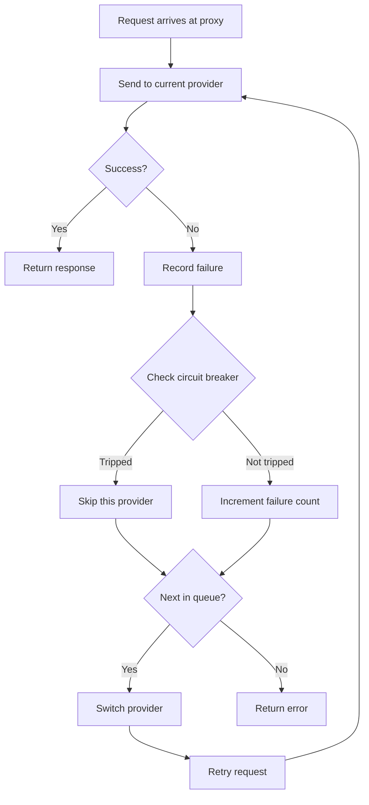
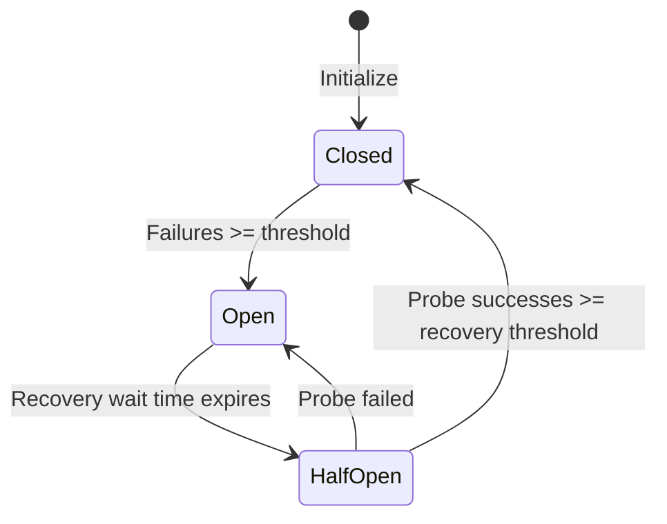

# 4.3 Failover

## Overview

The failover feature automatically switches to a backup provider when the primary provider's request fails, ensuring uninterrupted service.

**Applicable scenarios**:
- Unstable provider services
- High availability requirements
- Long-running tasks

## Prerequisites

Using the failover feature requires:

1. Proxy service started
2. App takeover enabled
3. Failover queue configured
4. Auto failover enabled

## Configure the Failover Queue

### Open Configuration Page

Settings > Advanced > Failover

### Select Application

Three tabs at the top of the page:
- Claude
- Codex
- Gemini

Select the application to configure.

### Add Backup Providers

1. In the "Failover Queue" area
2. Click "Add Provider"
3. Select a provider from the dropdown list
4. The provider is added to the end of the queue

### Adjust Priority

Drag providers to adjust their order:
- Lower numbers mean higher priority
- After the primary provider fails, backup providers are tried in order

### Remove Provider

Click the "Remove" button to the right of the provider.

## Main Interface Quick Actions

When both proxy and failover are enabled, provider cards display a failover toggle.

### Add to Queue

1. Find the provider card
2. Enable the failover toggle
3. The provider is automatically added to the queue

### Remove from Queue

1. Disable the failover toggle on the provider card
2. The provider is removed from the queue

## Enable Auto Failover

### Steps

1. On the failover configuration page
2. Enable the "Auto Failover" toggle

### Toggle Description

| State | Behavior |
|-------|----------|
| Off | Only records failures, no automatic switching |
| On | Automatically switches to the next provider on failure |

## Failover Flow

## Circuit Breaker Configuration

The circuit breaker prevents frequent retries against failing providers.

### Configuration Items

Different apps have independent default configurations. Below are general defaults; Claude has its own relaxed configuration.

| Setting | Description | General Default | Claude Default | Range |
|---------|-------------|-----------------|----------------|-------|
| Failure Threshold | Consecutive failures to trigger circuit breaker | 4 | 8 | 1-20 |
| Recovery Success Threshold | Successes needed in half-open state to close breaker | 2 | 3 | 1-10 |
| Recovery Wait Time | Time before attempting recovery after tripping (seconds) | 60 | 90 | 0-300 |
| Error Rate Threshold | Error rate that opens the circuit breaker | 60% | 70% | 0-100% |
| Minimum Requests | Minimum requests before calculating error rate | 10 | 15 | 5-100 |

> Claude has more relaxed default settings due to longer request times, tolerating more failures.

### Timeout Configuration

| Setting | Description | General Default | Claude Default | Range |
|---------|-------------|-----------------|----------------|-------|
| Stream First Byte Timeout | Max wait time for first data chunk (seconds) | 60 | 90 | 1-120 |
| Stream Idle Timeout | Max interval between data chunks (seconds) | 120 | 180 | 60-600 (0 to disable) |
| Non-stream Timeout | Total timeout for non-streaming requests (seconds) | 600 | 600 | 60-1200 |

### Retry Configuration

| Setting | Description | General Default | Claude Default | Range |
|---------|-------------|-----------------|----------------|-------|
| Max Retries | Number of retries on request failure | 3 | 6 | 0-10 |

> Gemini's default max retries is 5.

### Circuit Breaker States

| State | Description |
|-------|-------------|
| Closed | Normal state, requests allowed |
| Open | Circuit broken, this provider is skipped |
| Half-Open | Attempting recovery, sending probe requests |

### State Transitions

## Health Status Indicators

### Provider Cards

Cards display health status badges:

| Badge | Status | Description |
|-------|--------|-------------|
| Green | Healthy | 0 consecutive failures |
| Yellow | Warning | Has failures but circuit not tripped |
| Red | Circuit Broken | Circuit breaker tripped, temporarily skipped |

### Queue List

The failover queue also displays each provider's health status.

## Failover Logs

Each failover event records:

| Information | Description |
|-------------|-------------|
| Time | When it occurred |
| Original Provider | The provider that failed |
| New Provider | The provider switched to |
| Failure Reason | Error message |

Viewable in the request logs within usage statistics.

## Best Practices

### Queue Configuration Recommendations

1. **Primary provider**: The most stable and fastest provider
2. **First backup**: Second-best choice
3. **Second backup**: Last resort

### Circuit Breaker Configuration Recommendations

| Scenario | Failure Threshold | Recovery Wait |
|----------|-------------------|---------------|
| High availability requirement | 2 | 30 seconds |
| General scenario | 3 | 60 seconds |
| Tolerant of occasional failures | 5 | 120 seconds |

### Monitoring Recommendations

Periodically check:
- Health status of each provider
- Failover frequency
- Circuit breaker trigger frequency

## FAQ

### Failover Not Triggering

Check:
1. Is the proxy service running
2. Is app takeover enabled
3. Is auto failover enabled
4. Are there backup providers in the queue

### Failover Triggering Too Frequently

Possible causes:
- Unstable primary provider
- Network issues
- Configuration errors

Solutions:
- Check primary provider status
- Adjust circuit breaker parameters
- Consider changing the primary provider

### All Providers Circuit-Broken

Wait for the recovery wait time to expire for automatic recovery, or:
1. Manually restart the proxy service
2. Reset circuit breaker states
