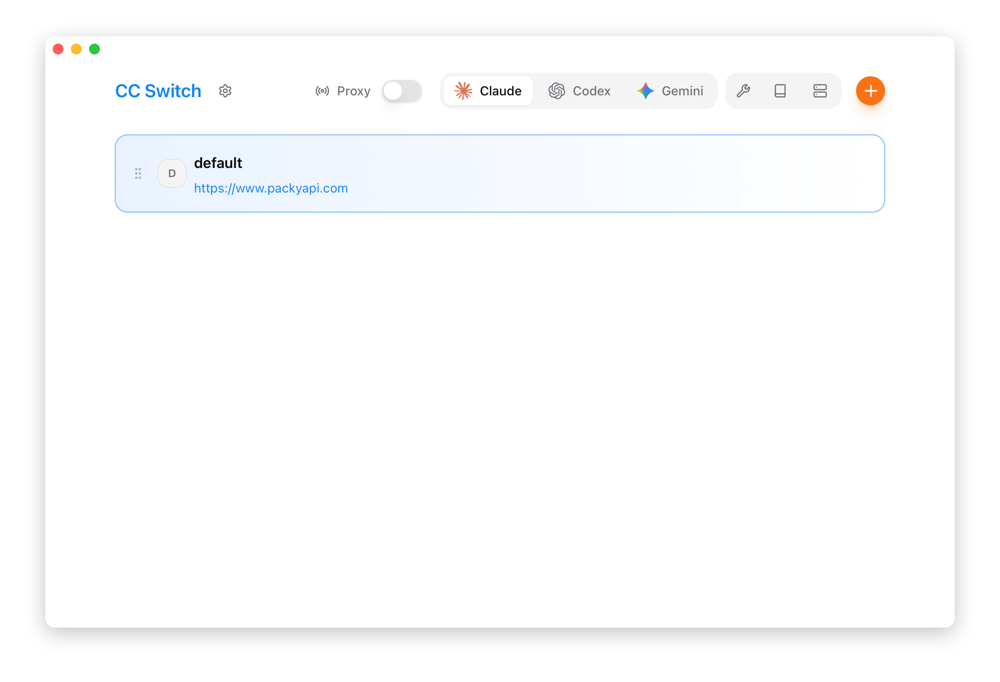
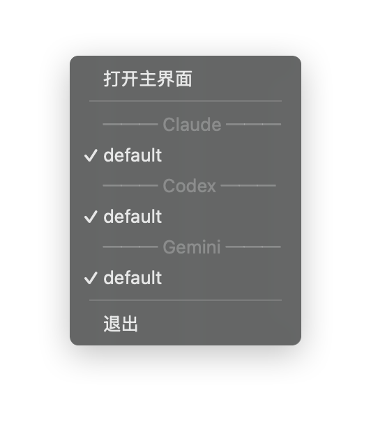

# 1.3 インターフェース概要

## メイン画面のレイアウト

## 上部ナビゲーションバー

| 番号 | 要素 | 機能説明 |
|------|------|----------|
| ① | Logo | クリックで GitHub プロジェクトページにアクセス |
| ② | 設定ボタン | 設定ページを開く（ショートカット `Cmd/Ctrl + ,`） |
| ③ | プロキシスイッチ | ローカルプロキシサービスの起動/停止 |
| ④ | アプリ切り替え | Claude / Claude Desktop / Codex / Gemini / OpenCode / OpenClaw / Hermes を切り替え |
| ⑤ | 機能エリア | Skills / Prompts / MCP の入口 |
| ⑥ | 追加ボタン | 新しいプロバイダーを追加 |

### アプリ切り替え

ドロップダウンメニューをクリックして、現在管理するアプリを切り替えます：

- **Claude** - Claude Code の設定を管理
- **Claude Desktop** - Claude Desktop のサードパーティプロバイダーと公式モードを管理
- **Codex** - Codex の設定を管理
- **Gemini** - Gemini CLI の設定を管理
- **OpenCode** - OpenCode の設定を管理
- **OpenClaw** - OpenClaw の設定を管理
- **Hermes** - Hermes Agent のプロバイダーと Memory を管理

切り替え後、プロバイダーリストに対応アプリの設定が表示されます。

### 機能エリアボタン

| ボタン | 機能 | 表示条件 |
|------|------|----------|
| Skills | スキル拡張管理 | 常に表示 |
| Prompts | システムプロンプト管理 | 常に表示 |
| MCP | MCP サーバー管理 | 常に表示 |

## プロバイダーカード

各プロバイダーはカード形式で表示されます。左から右へ以下の要素が含まれています：

### カード要素（左から右）

| 番号 | 要素 | アイコン | 機能説明 |
|------|------|------|----------|
| ① | ドラッグハンドル | ≡ | 長押しして上下にドラッグしてプロバイダーの順序を調整 |
| ② | プロバイダーアイコン | - | プロバイダーのブランドアイコンを表示、カラーのカスタマイズ可能 |
| ③ | プロバイダー情報 | - | 名前、メモ/エンドポイントアドレス（クリックで公式サイトを開く） |
| ④ | 使用量情報 | - | 残額を表示、複数プランの場合はプラン数を表示 |
| ⑤ | 有効化ボタン | ▶ | 現在使用中のプロバイダーに切り替え |
| ⑥ | 編集ボタン | ✏️ | プロバイダー設定を編集 |
| ⑦ | 複製ボタン | - | プロバイダーを複製（コピーを作成） |
| ⑧ | テストボタン | - | モデルの可用性と応答速度をテスト |
| ⑨ | 使用量クエリ | - | 使用量クエリスクリプトを設定 |
| ⑩ | 削除ボタン | - | プロバイダーを削除（現在有効な場合は無効） |

> **ヒント**：操作ボタンエリア（⑤-⑩）はマウスホバー時に表示され、通常は非表示で画面をすっきり保ちます。

v3.15.0 から、Claude Code と Codex の一部プロバイダーカードには **Local Routing 対応バッジ**も表示されます。ローカルルーティング経由で利用できるプロバイダーを素早く判別できます。

### ボタンの詳細説明

| ボタン | 状態変化 | 説明 |
|------|----------|------|
| **有効化** | 有効化済みの場合は ✓ を表示して無効化 | フェイルオーバーモードでは「参加/参加済み」に変化 |
| **編集** | 常に使用可能 | 編集パネルを開いて設定を変更 |
| **複製** | 常に使用可能 | プロバイダーのコピーを作成、名前に `copy` が付加 |
| **テスト** | テスト中はローディングアニメーション | プロキシサービス実行中のみ使用可能 |
| **使用量クエリ** | 常に使用可能 | カスタム使用量クエリスクリプトを設定 |
| **削除** | 現在有効な場合は半透明で無効 | 先に他のプロバイダーに切り替える必要あり |

### カードの状態

| 状態 | 枠の色 | 説明 |
|------|----------|------|
| **現在有効** | 青い枠 | 通常モードで現在使用中のプロバイダー |
| **プロキシアクティブ** | 緑の枠 | プロキシ接管モードで実際に使用中のプロバイダー |
| **通常状態** | デフォルトの枠 | 有効化されていないプロバイダー |
| **フェイルオーバー中** | 優先度バッジを表示 | P1、P2 などのフェイルオーバー優先度を表示 |

### ヘルスステータスバッジ

プロキシモードでは、フェイルオーバーキューに参加しているプロバイダーにヘルスステータスが表示されます：

| バッジ | 色 | 説明 |
|------|------|------|
| 健康 | 緑 | 連続失敗回数 0 |
| 警告 | 黄 | 連続失敗回数 1-2 |
| 不健康 | 赤 | 連続失敗回数 ≥3、サーキットブレーカーが発動する可能性あり |

## システムトレイ

CC Switch はシステムトレイにアイコンを表示し、クイック操作の入口を提供します。

### トレイメニュー構造

### メニュー機能

| メニュー項目 | 機能 |
|--------|------|
| メインウィンドウを開く | メインウィンドウを表示してフォーカス |
| アプリサブメニュー | Claude/Codex/Gemini ごとの折りたたみサブメニュー（例：「Claude · PackyCode」）。利用可能な場合は現在のプロバイダーとキャッシュ済み使用量サマリーも表示 |
| プロバイダーリスト | 各サブメニュー内でクリックして切り替え、現在有効なものにはチェックマークを表示 |
| ライトウェイトモード | トグルチェックボックスでトレイ専用モードの開始/終了 |
| 終了 | アプリを完全に終了 |

> **注意**：各トレイサブメニューのタイトルには現在のプロバイダー名が表示されます（例：「Claude · PackyCode」）。プロバイダーが設定されていないアプリでは、無効化された「(プロバイダーなし)」エントリが表示されます。トレイは現在、プロキシルーティングと使用量サマリーに対応する Claude / Codex / Gemini にフォーカスしています。メイン画面のアプリ表示はアプリの表示設定で制御されます。

### 多言語対応

トレイメニューは 3 つの言語に対応し、設定に応じて自動的に切り替わります：

| 言語 | メインウィンドウを開く | 終了 |
|------|-----------|------|
| 中文 | 打开主界面 | 退出 |
| English | Open main window | Quit |
| 日本語 | メインウィンドウを開く | 終了 |

### ライトウェイトモード

トレイメニューには **ライトウェイトモード** のトグル（チェックボックス）があります。有効にすると：

- メインウィンドウが閉じられ、リソースが解放される
- アプリはシステムトレイのみで動作を継続
- トレイのサブメニューからプロバイダーの切り替えが可能
- macOS では Dock アイコンも非表示になる

ライトウェイトモードを終了するには、トグルのチェックを外すか「メインウィンドウを開く」をクリックします。メインウィンドウが再構築されて表示されます。

### 使用シーン

トレイからのプロバイダー切り替えはメイン画面を開く必要がなく、以下の場面に適しています：

- 頻繁にプロバイダーを切り替える場合
- メインウィンドウが最小化されているときの素早い操作
- バックグラウンド実行中の設定管理
- ライトウェイトモードでリソース使用量を最小化

## 設定ページ

設定ページは複数のタブに分かれています：

### 一般タブ

- 言語設定（中文/English/日本語）
- テーマ設定（システムに合わせる/ライト/ダーク）
- ウィンドウ動作（起動時に自動実行、閉じる動作）

### 詳細タブ

- 設定ディレクトリの設定
- プロキシサービスの設定
- フェイルオーバーの設定
- 料金設定
- データのインポート/エクスポート

### 使用量タブ

- リクエスト統計の概要
- トレンドグラフ
- リクエストログ
- プロバイダー/モデル統計

### バージョン情報タブ

- バージョン情報
- 更新の確認
- オープンソースライセンス

## ショートカットキー

| ショートカット | 機能 |
|--------|------|
| `Cmd/Ctrl + ,` | 設定を開く |
| `Cmd/Ctrl + F` | プロバイダーを検索 |
| `Esc` | ダイアログ/検索を閉じる |

## 検索機能

`Cmd/Ctrl + F` で検索ボックスを開きます：

- 名前、メモ、URL で検索可能
- プロバイダーリストをリアルタイムでフィルタリング
- `Esc` で検索を閉じる
