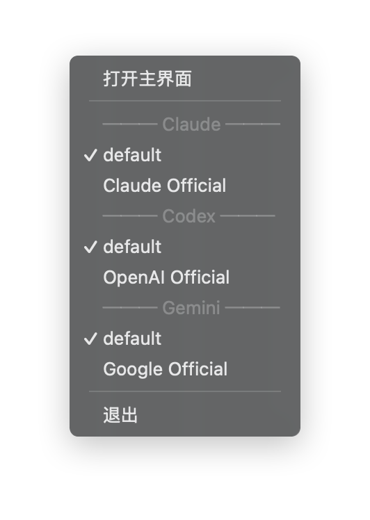

# 2.2 プロバイダーの切り替え

## メイン画面での切り替え

プロバイダーリストで、対象のプロバイダーカードの「有効化」ボタンをクリックします。

### 切り替えフロー

1. 「有効化」ボタンをクリック
2. CC Switch が設定ファイルを更新
3. カードのステータスが「現在有効」に変更
4. Claude/Gemini は即時反映、Codex はターミナルの再起動が必要

### ステータス表示

| ステータス | 表示 | 説明 |
|------|------|------|
| 現在有効 | 青い枠 + ラベル | 設定ファイル内の現在のプロバイダー |
| プロキシアクティブ | 緑の枠 | プロキシモードで実際に使用中のプロバイダー |
| 通常 | デフォルトのスタイル | 有効化されていないプロバイダー |

## トレイでの素早い切り替え

システムトレイから素早く切り替えられ、メイン画面を開く必要がありません。

### 操作手順

1. システムトレイの CC Switch アイコンを右クリック
2. 対応するアプリのサブメニュー（例：「Claude · 現在のプロバイダー」）にマウスを合わせる
3. 切り替えたいプロバイダー名をクリック
4. 切り替え完了、トレイに短い通知が表示

### トレイメニュー構造

v3.13.0 より、トレイメニューがフラットなリストから **アプリ別サブメニュー** にリファクタリングされ、各アプリに独立したサブメニューが用意されました：

| サブメニュー | 説明                                                                 |
| ------------ | -------------------------------------------------------------------- |
| Claude       | Claude のすべてのプロバイダー（Codex OAuth リバースプロキシを含む）  |
| Codex        | Codex のすべてのプロバイダー                                         |
| Gemini       | Gemini のすべてのプロバイダー                                        |

**リファクタリングの利点**：

- **メニューのオーバーフロー防止**：プロバイダーが多数ある場合、フラットなリストでは画面の高さを超えますが、アプリ別サブメニューは自然にスケールします
- **サブメニューのタイトルに現在有効なプロバイダーと使用量サマリーを表示**：サブメニューを開かなくても、Claude / Codex / Gemini がどのプロバイダーを使用中か、利用可能なキャッシュ済み使用量情報とあわせて確認できます
- **アプリ別の分離**：Claude のプロバイダーを切り替えても Codex や Gemini のビューには影響しません

> **ヒント**：バックグラウンド常駐 + 軽量モード + アプリ別サブメニューの組み合わせは、複数のアプリを頻繁に切り替えるヘビーユーザーに特に適しています。[1.5 個人設定 → 軽量モード](../1-getting-started/1.5-settings.md) を参照してください。



## 反映方法

### Claude Code

**切り替え後に即時反映**、再起動は不要です。

Claude Code はホットリロードに対応しており、設定ファイルの変更を自動検出して再読み込みします。

### Codex

切り替え後は再起動が必要：
- 現在のターミナルウィンドウを閉じる
- ターミナルを再度開く

### Gemini CLI

**切り替え後に即時反映**、再起動は不要です。

Gemini CLI はリクエストごとに `.env` ファイルを再読み込みします。

## 設定ファイルの変更

プロバイダーを切り替える際、CC Switch は以下のファイルを変更します：

### Claude

```
~/.claude/settings.json
```

変更内容：
```json
{
  "env": {
    "ANTHROPIC_API_KEY": "新しい API Key",
    "ANTHROPIC_BASE_URL": "新しいエンドポイント"
  }
}
```

### Codex

```
~/.codex/auth.json
~/.codex/config.toml（追加設定がある場合）
```

### Gemini

```
~/.gemini/.env
~/.gemini/settings.json
```

## 切り替え失敗時の対処

切り替えに失敗した場合、考えられる原因：

### 設定ファイルがロックされている

他のプログラムが設定ファイルを使用中です。

**解決方法**：実行中の CLI ツールを閉じてから、再度切り替えを試みてください。

### 権限不足

設定ファイルへの書き込み権限がありません。

**解決方法**：設定ディレクトリの権限設定を確認してください。

### 設定形式エラー

プロバイダー設定の JSON 形式に誤りがあります。

**解決方法**：プロバイダーを編集して、JSON 形式を確認・修正してください。
