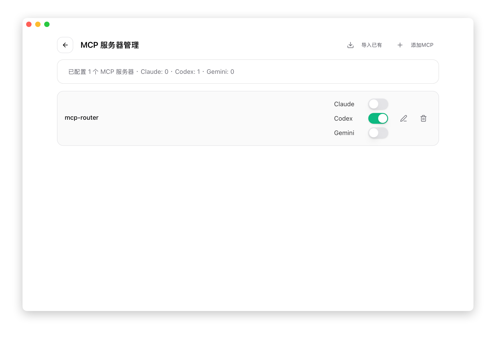
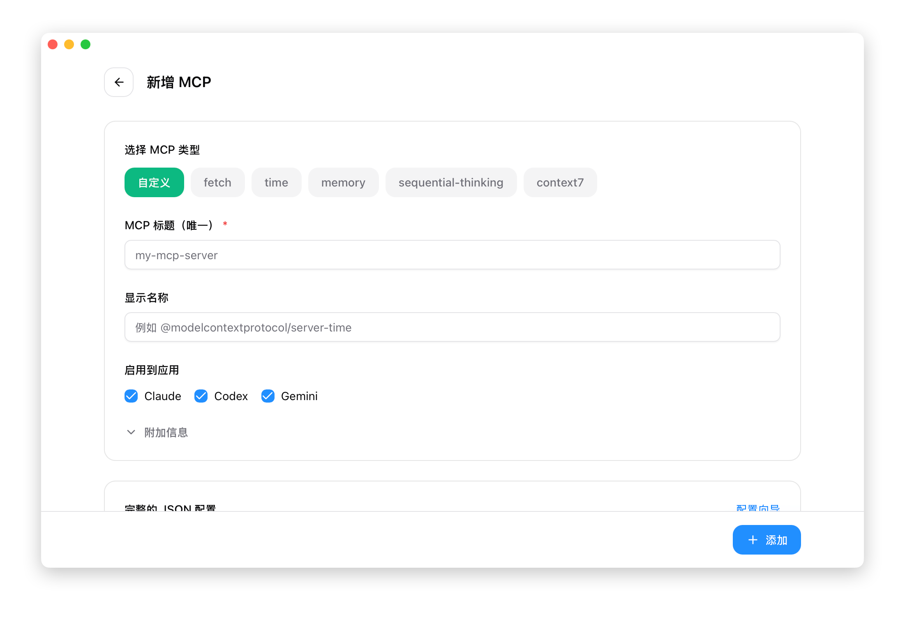

# 3.1 MCP サーバー管理

## MCP とは

MCP (Model Context Protocol) は、AI ツールが外部データソースやツールにアクセスできるようにするプロトコルです。MCP サーバーにより、AI は以下のことが可能になります：

- ファイルシステムへのアクセス
- ネットワークリクエストの実行
- データベースのクエリ
- 外部 API の呼び出し

## MCP パネルを開く

上部ナビゲーションバーの **MCP** ボタンをクリックします。

## パネル概要



## MCP サーバーの追加

### プリセットテンプレートを使用

1. 右上の **+** ボタンをクリック
2. 「プリセット」ドロップダウンからテンプレートを選択
3. 必要に応じて設定を変更
4. 「保存」をクリック



### 主なプリセット

| プリセット | パッケージ名 | 機能説明 |
|------|------|----------|
| fetch | mcp-server-fetch | HTTP リクエストツール、AI が Web コンテンツを取得可能に |
| time | @modelcontextprotocol/server-time | 時間ツール、現在の時刻情報を提供 |
| memory | @modelcontextprotocol/server-memory | メモリツール、AI が情報を保存・検索可能に |
| sequential-thinking | @modelcontextprotocol/server-sequential-thinking | 思考連鎖ツール、AI の推論能力を強化 |
| context7 | @upstash/context7-mcp | ドキュメント検索ツール、技術ドキュメントをクエリ |

### カスタム設定

「カスタム」を選択した場合、以下を入力する必要があります：

| フィールド | 必須 | 説明 |
|------|------|------|
| サーバー ID | はい | 一意な識別子 |
| 名前 | いいえ | 表示名 |
| 説明 | いいえ | 機能の説明 |
| 転送タイプ | はい | stdio / http / sse |
| コマンド | はい* | stdio タイプの場合は必須 |
| 引数 | いいえ | コマンドライン引数 |
| URL | はい* | http/sse タイプの場合は必須 |
| Headers | いいえ | http/sse タイプのリクエストヘッダー |
| 環境変数 | いいえ | サーバーに渡す環境変数 |

## 転送タイプ

### stdio（標準入出力）

最も一般的なタイプで、ローカルプロセスを起動して通信します。

```json
{
  "command": "uvx",
  "args": ["mcp-server-fetch"],
  "env": {}
}
```

**要件**：
- 対応するコマンド（例：`uvx`、`npx`）がインストールされている必要あり
- サーバープログラムが PATH に含まれている必要あり

### http

HTTP プロトコルでリモートサーバーと通信します。

```json
{
  "url": "http://localhost:8080/mcp"
}
```

### sse（Server-Sent Events）

SSE プロトコルでサーバーと通信し、リアルタイムプッシュをサポートします。

```json
{
  "url": "http://localhost:8080/sse"
}
```

## アプリバインド

各 MCP サーバーは、有効にするアプリを個別に制御できます。

### スイッチの説明

| スイッチ | 作用 | 設定ファイルパス |
|------|------|--------------|
| Claude | Claude Code に同期 | `~/.claude.json` の `mcpServers` |
| Codex | Codex に同期 | `~/.codex/config.toml` の `[mcp_servers]` |
| Gemini | Gemini CLI に同期 | `~/.gemini/settings.json` の `mcpServers` |
| OpenCode | OpenCode に同期 | `~/.opencode/config.json` の `mcpServers` |

> **注意**：OpenClaw は現在 MCP サーバー管理に対応していません。MCP 機能は現在 Claude、Codex、Gemini、OpenCode の 4 つのアプリのみサポートしています。

### スイッチの動作

あるアプリのスイッチをオンにすると、CC Switch は以下を実行します：

1. **データベースの更新**：サーバーの `apps.claude/codex/gemini/opencode` のステータスを `true` に設定
2. **Live 設定に同期**：サーバー設定を対応アプリの設定ファイルに書き込み
3. **即時反映**：次回 CLI ツール起動時に新しい MCP サーバーが自動的にロード

あるアプリのスイッチをオフにすると、CC Switch は以下を実行します：

1. **データベースの更新**：対応アプリのステータスを `false` に設定
2. **Live 設定から削除**：アプリの設定ファイルからそのサーバーを削除
3. **即時反映**：次回 CLI ツール起動時にその MCP サーバーはロードされない

### 同期条件

MCP サーバーの同期は、対応アプリがインストールされている場合のみ実行されます：

- **Claude**：`~/.claude/` ディレクトリまたは `~/.claude.json` ファイルが存在する必要あり
- **Codex**：`~/.codex/` ディレクトリが存在する必要あり
- **Gemini**：`~/.gemini/` ディレクトリが存在する必要あり
- **OpenCode**：`~/.opencode/` ディレクトリが存在する必要あり

> **ヒント**：CLI ツールがインストールされていない場合、対応するスイッチをオンにしてもエラーにはなりませんが、設定は書き込まれません。

スイッチをオフにすると、設定はファイルから削除されます。

## サーバーの編集

1. サーバー行の右側にある「編集」ボタンをクリック
2. 設定を変更
3. 「保存」をクリック

変更は有効になっているアプリの設定ファイルに即座に同期されます。

## サーバーの削除

1. サーバー行の右側にある「削除」ボタンをクリック
2. 削除を確認

削除後、設定はすべてのアプリの設定ファイルから削除されます。

## 既存の設定のインポート

CLI ツールで既に MCP サーバーを設定している場合、CC Switch にインポートできます：

1. 「インポート」ボタンをクリック
2. インポートするアプリを選択（Claude/Codex/Gemini/OpenCode）
3. CC Switch が既存の設定を読み取ってインポート

## 設定ファイル形式

### Claude (`~/.claude.json`)

```json
{
  "mcpServers": {
    "mcp-fetch": {
      "command": "uvx",
      "args": ["mcp-server-fetch"]
    }
  }
}
```

### Codex (`~/.codex/config.toml`)

```toml
[mcp_servers.mcp-fetch]
command = "uvx"
args = ["mcp-server-fetch"]
```

### Gemini (`~/.gemini/settings.json`)

```json
{
  "mcpServers": {
    "mcp-fetch": {
      "command": "uvx",
      "args": ["mcp-server-fetch"]
    }
  }
}
```

## よくある質問

### サーバーの起動に失敗する

確認事項：
- コマンドが正しくインストールされているか（例：`uvx`）
- コマンドが PATH に含まれているか
- 引数が正しいか

### 設定が反映されない

確認事項：
- 対応するアプリのスイッチがオンになっているか
- CLI ツールを再起動したか
