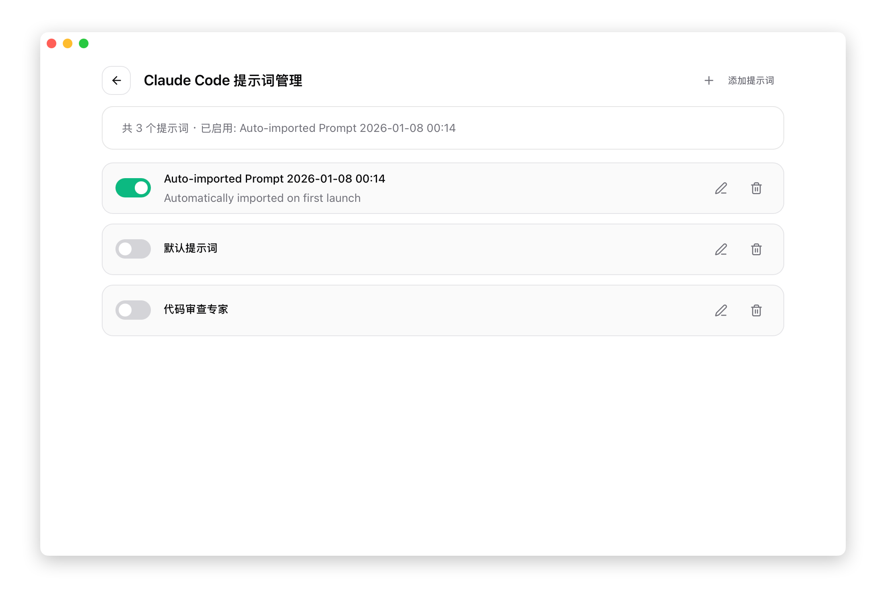

# 3.2 Prompts プロンプト管理

## 機能説明

Prompts 機能は、システムプロンプトのプリセットを管理します。システムプロンプトは AI の動作や回答スタイルに影響します。

CC Switch を使用すると：

- 複数のプロンプトプリセットを作成
- さまざまなシーンのプロンプトを素早く切り替え
- デバイス間でプロンプト設定を同期

## Prompts パネルを開く

上部ナビゲーションバーの **Prompts** ボタンをクリックします。

## パネル概要



## プリセットの作成

### 操作手順

1. 右上の **+** ボタンをクリック
2. プリセット名を入力
3. Markdown エディタでプロンプトを作成
4. 「保存」をクリック

### Markdown エディタ

エディタは以下を提供します：

- シンタックスハイライト
- リアルタイムプレビュー
- よく使うフォーマットのショートカットキー

### プロンプトの書き方のヒント

**構造化フォーマット**：

```markdown
# 役割定義

あなたはプロのコードレビュー専門家です。

## コア能力

- コード品質分析
- パフォーマンス最適化の提案
- セキュリティ脆弱性の検出

## 回答スタイル

- 簡潔明瞭
- 具体的な例を提供
- 改善提案を提示

## 注意事項

- ビジネスロジックを変更しない
- コードスタイルの一貫性を保つ
```

## プリセットの有効化

### 操作方法

プリセット項目のスイッチボタンをクリックして、有効/無効を切り替えます。

### 単一有効化

同時に有効にできるプリセットは 1 つだけです。新しいプリセットを有効にすると、以前のプリセットは自動的に無効になります。

### 同期先

有効化後、プロンプトは対応するアプリのファイルに書き込まれます：

| アプリ | ファイルパス |
|------|----------|
| Claude | `~/.claude/CLAUDE.md` |
| Codex | `~/.codex/AGENTS.md` |
| Gemini | `~/.gemini/GEMINI.md` |
| OpenCode | `~/.opencode/AGENTS.md` |
| OpenClaw | `~/.openclaw/AGENTS.md` |

## プリセットの編集

1. プリセット項目の「編集」ボタンをクリック
2. 名前や内容を変更
3. 「保存」をクリック

現在有効なプリセットを編集した場合、保存後に設定ファイルに即座に同期されます。

## プリセットの削除

1. プリセット項目の「削除」ボタンをクリック
2. 削除を確認

有効になっているプリセットは削除できません。先に無効にしてから削除してください。

## スマートバックフィル

CC Switch は、手動での変更を失わないようにスマートバックフィル保護機能を提供しています。

### 動作原理

1. プリセットを切り替える前に、現在の設定ファイルの内容を自動的に読み取る
2. ファイルの内容とデータベース内のプリセットを比較
3. 内容が異なる場合、ユーザーが手動で変更したことを示す
4. 手動変更の内容を現在のプリセットに保存
5. その後、新しいプリセットに切り替え

### 保護シーン

| シーン | 処理方法 |
|------|----------|
| CLI 内で `CLAUDE.md` を直接編集 | 変更が自動的に現在のプリセットに保存 |
| 外部エディタで設定ファイルを変更 | 変更が自動的に現在のプリセットに保存 |
| 別のプリセットに切り替え | 現在の変更を保存してから切り替え |

### 技術的な詳細

バックフィル機能は以下のタイミングでトリガーされます：

- **プリセットの切り替え時**：現在の live ファイルの内容を現在のプリセットに保存
- **現在のプリセットの編集時**：live ファイルから最新の内容を読み取り
- **初回起動時**：既存の live ファイルの内容を自動インポート

### 注意事項

- バックフィルは異なるプリセットに切り替えるときにのみトリガーされる
- 現在有効なプリセットがない場合、バックフィルはトリガーされない
- バックフィルの失敗は切り替えフローに影響しない

## アプリ間での使用

Prompts はアプリごとに個別に管理されます：

- Claude に切り替えると、Claude のプリセットが表示
- Codex に切り替えると、Codex のプリセットが表示
- Gemini に切り替えると、Gemini のプリセットが表示
- OpenCode に切り替えると、OpenCode のプリセットが表示
- OpenClaw に切り替えると、OpenClaw のプリセットが表示

複数のアプリで同じプロンプトを使用する場合は、それぞれで作成する必要があります。

## インポート・エクスポート

### ディープリンクで共有

ディープリンクを生成してプリセットを共有できます：

```
ccswitch://import/prompt?data=<Base64 エンコードされたプリセット>
```

### 設定のエクスポートで共有

設定をエクスポートするとすべてのプリセットが含まれ、インポートで復元できます。
