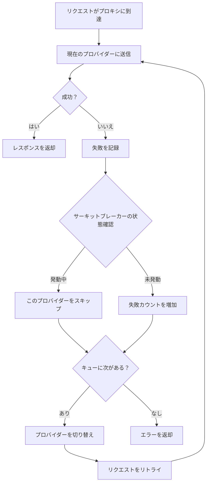
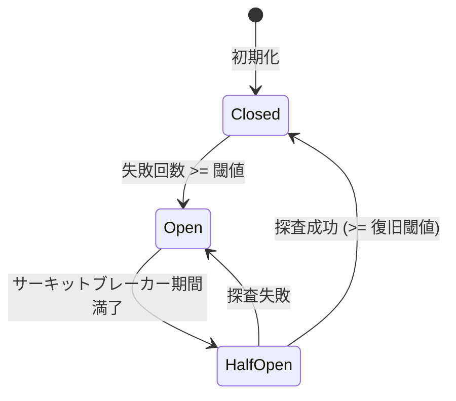

# 4.3 フェイルオーバー

## 機能説明

フェイルオーバー機能は、メインプロバイダーのリクエストが失敗した場合に、自動的にバックアッププロバイダーに切り替えてサービスの中断を防ぎます。

**適用シーン**：
- プロバイダーのサービスが不安定な場合
- 高可用性が必要な場合
- 長時間実行するタスク

## 前提条件

フェイルオーバー機能を使用するには：

1. プロキシサービスを起動
2. アプリケーション接管を有効化
3. フェイルオーバーキューを設定
4. 自動フェイルオーバーを有効化

## フェイルオーバーキューの設定

### 設定ページを開く

設定 → 詳細 → フェイルオーバー

### アプリの選択

ページ上部に 3 つのタブがあります：
- Claude
- Codex
- Gemini

設定するアプリを選択します。

### バックアッププロバイダーの追加

1. 「フェイルオーバーキュー」エリアで
2. 「プロバイダーを追加」をクリック
3. ドロップダウンリストからプロバイダーを選択
4. プロバイダーがキューの末尾に追加

### 優先順位の調整

プロバイダーをドラッグして順序を調整：
- 番号が小さいほど優先度が高い
- メインプロバイダーが失敗すると、順番にバックアッププロバイダーを試行

### プロバイダーの削除

プロバイダーの右側にある「削除」ボタンをクリックします。

## メイン画面でのクイック操作

プロキシとフェイルオーバーがどちらも有効な場合、プロバイダーカードにフェイルオーバースイッチが表示されます。

### キューに追加

1. プロバイダーカードを見つける
2. フェイルオーバースイッチをオンにする
3. プロバイダーが自動的にキューに追加

### キューから削除

1. プロバイダーカードのフェイルオーバースイッチをオフにする
2. プロバイダーがキューから削除

## 自動フェイルオーバーの有効化

### 操作手順

1. フェイルオーバー設定ページで
2. 「自動フェイルオーバー」スイッチをオンにする

### スイッチの説明

| 状態 | 動作 |
|------|------|
| オフ | 失敗を記録するのみ、自動切り替えなし |
| オン | 失敗時に自動的に次のプロバイダーに切り替え |

## フェイルオーバーのフロー

## サーキットブレーカーの設定

サーキットブレーカーは、失敗したプロバイダーへの頻繁なリトライを防止します。

### 設定項目

アプリごとに独立したデフォルト設定があります。以下は共通のデフォルト値で、Claude には独自の緩やかな設定があります。

| 設定 | 説明 | 共通デフォルト | Claude デフォルト | 範囲 |
|------|------|--------|--------|------|
| 失敗閾値 | 連続何回失敗でサーキットブレーカーが発動 | 4 | 8 | 1-20 |
| 復旧成功閾値 | ハーフオープン状態で何回成功したら閉じるか | 2 | 3 | 1-10 |
| 復旧待機時間 | サーキットブレーカー発動後の復旧試行までの時間（秒） | 60 | 90 | 0-300 |
| エラー率閾値 | この値を超えるとサーキットブレーカーが発動 | 60% | 70% | 0-100% |
| 最小リクエスト数 | エラー率計算前の最小リクエスト数 | 10 | 15 | 5-100 |

> Claude はリクエストに時間がかかるため、デフォルト設定はより緩やかで、多くの失敗を許容します。

### タイムアウト設定

| 設定 | 説明 | 共通デフォルト | Claude デフォルト | 範囲 |
|------|------|--------|--------|------|
| ストリーム初バイトタイムアウト | 最初のデータチャンクの最大待機時間（秒） | 60 | 90 | 1-120 |
| ストリームサイレントタイムアウト | データチャンク間の最大間隔（秒） | 120 | 180 | 60-600（0 で無効化） |
| 非ストリームタイムアウト | 非ストリームリクエストの総タイムアウト時間（秒） | 600 | 600 | 60-1200 |

### リトライ設定

| 設定 | 説明 | 共通デフォルト | Claude デフォルト | 範囲 |
|------|------|--------|--------|------|
| 最大リトライ回数 | リクエスト失敗時のリトライ回数 | 3 | 6 | 0-10 |

> Gemini のデフォルト最大リトライ回数は 5 です。

### サーキットブレーカーの状態

| 状態 | 説明 |
|------|------|
| 閉（Closed） | 正常状態、リクエストを許可 |
| 開（Open） | サーキットブレーカー発動中、このプロバイダーをスキップ |
| 半開（Half-Open） | 復旧試行中、探査リクエストを送信 |

### 状態遷移

## ヘルスステータスの表示

### プロバイダーカード

カードにヘルスステータスバッジが表示されます：

| バッジ | 状態 | 説明 |
|------|------|------|
| 緑 | 健康 | 連続失敗回数 0 |
| 黄 | 警告 | 失敗はあるがサーキットブレーカー未発動 |
| 赤 | サーキットブレーカー発動 | 一時的にスキップ |

### キューリスト

フェイルオーバーキューにも各プロバイダーのヘルスステータスが表示されます。

## フェイルオーバーログ

各フェイルオーバーの記録内容：

| 情報 | 説明 |
|------|------|
| 時間 | 発生時刻 |
| 元のプロバイダー | 失敗したプロバイダー |
| 新しいプロバイダー | 切り替え先のプロバイダー |
| 失敗理由 | エラー情報 |

使用量統計のリクエストログで確認できます。

## ベストプラクティス

### キュー設定のアドバイス

1. **メインプロバイダー**：最も安定で高速なプロバイダー
2. **第 1 バックアップ**：次善の選択
3. **第 2 バックアップ**：最後の手段

### サーキットブレーカー設定のアドバイス

| シーン | 失敗閾値 | サーキットブレーカー期間 |
|------|----------|----------|
| 高可用性要件 | 2 | 30 秒 |
| 一般的なシーン | 3 | 60 秒 |
| 偶発的な失敗を許容 | 5 | 120 秒 |

### 監視のアドバイス

定期的に確認：
- 各プロバイダーのヘルスステータス
- フェイルオーバーの発生頻度
- サーキットブレーカーの発動状況

## よくある質問

### フェイルオーバーがトリガーされない

確認事項：
1. プロキシサービスが実行中か
2. アプリケーション接管が有効か
3. 自動フェイルオーバーが有効か
4. キューにバックアッププロバイダーがあるか

### フェイルオーバーが頻繁にトリガーされる

考えられる原因：
- メインプロバイダーが不安定
- ネットワークの問題
- 設定のエラー

解決方法：
- メインプロバイダーの状態を確認
- サーキットブレーカーのパラメータを調整
- メインプロバイダーの変更を検討

### すべてのプロバイダーがサーキットブレーカー発動中

サーキットブレーカー期間満了後に自動復旧を待つか、以下を実行：
1. プロキシサービスを手動で再起動
2. サーキットブレーカーの状態をリセット
