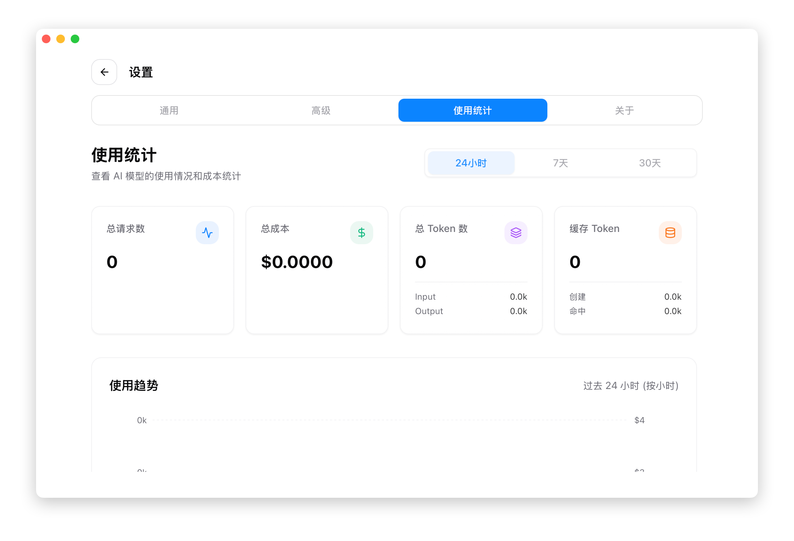
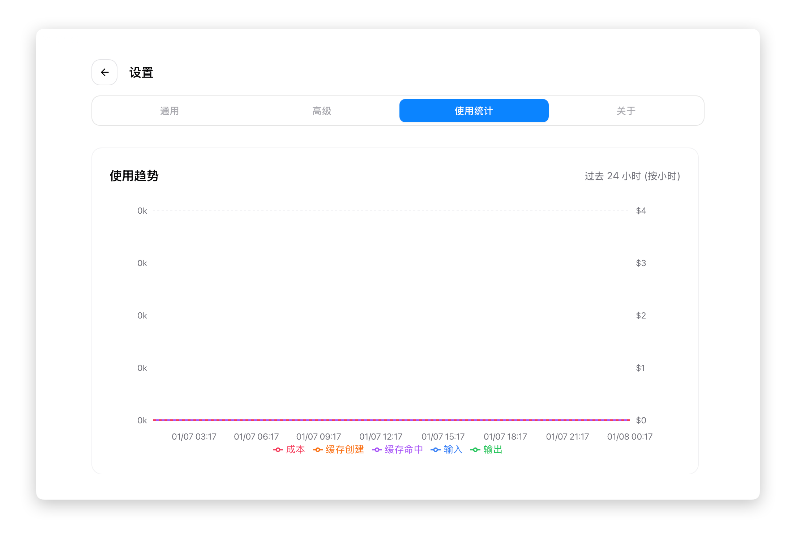
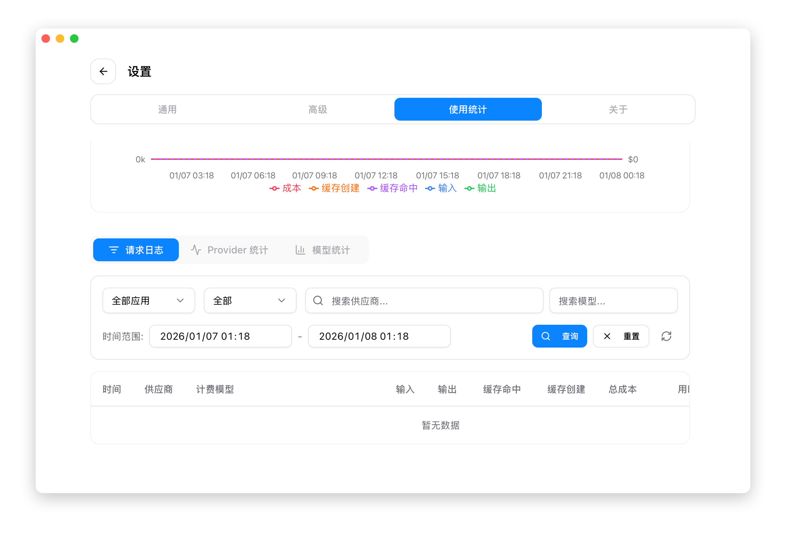
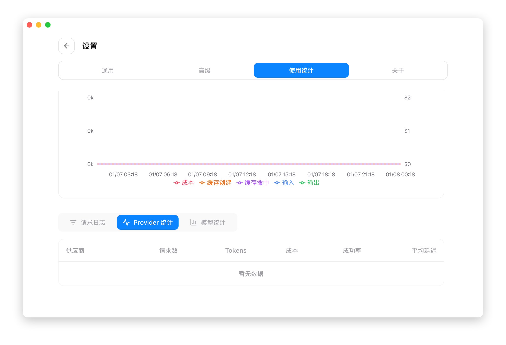
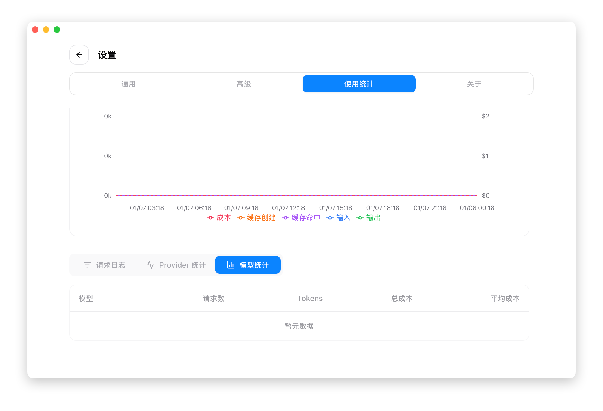
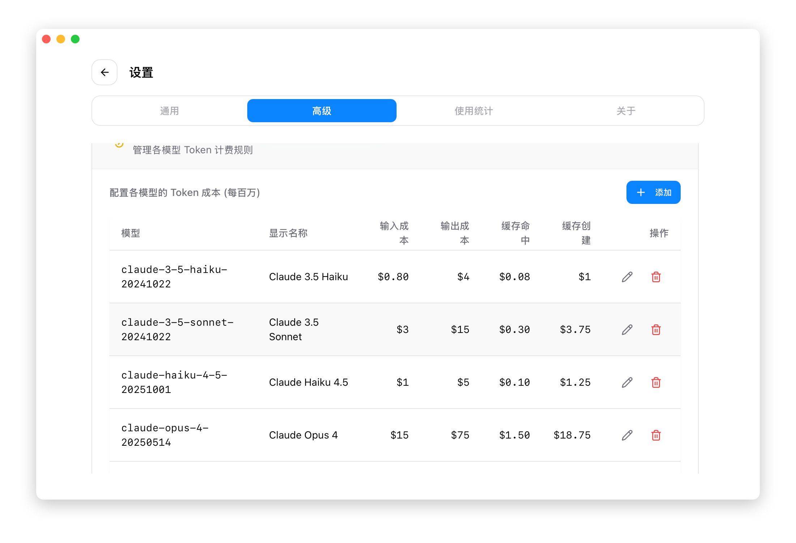

# 4.4 使用量統計

## 機能説明

使用量統計機能は、API リクエストデータを記録・分析して、以下をサポートします：

- API の使用状況の把握
- 費用支出の見積もり
- 使用パターンの分析
- 問題のトラブルシューティング

v3.13.0 より、使用量データの取得元は 2 つあります：

| データ取得元                       | 対象範囲                                | プロキシ経由が必要？ |
| ---------------------------------- | --------------------------------------- | -------------------- |
| **プロキシリクエストログ**         | プロキシを経由したすべてのリクエスト    | 必要                 |
| **CLI セッションログ**（v3.13 新規）| Claude / Codex / Gemini のセッション履歴 | 不要                 |

- **Codex セッション**：JSONL セッションログに基づく **精密な解析** に切り替え、従来の推定値を置き換え。モデル名を正規化することで料金検索の整合性を保証
- **Gemini セッション**：Gemini CLI のセッションログから精密に同期
- **Claude セッション**：セッションログから直接使用量をインポート可能
- 使用量パネルは **アプリ別フィルタリング**（Claude / Codex / Gemini）に対応し、データが混在しません

## 前提条件

使用するデータ取得元によって前提条件が異なります：

**プロキシリクエストログ**（すべてのアプリとプロキシリクエストを対象）：

1. プロキシサービスを起動
2. アプリケーション接管を有効化
3. ログ記録を有効化

**CLI セッションログ**（v3.13 新規、プロキシ不要）：

1. CC Switch で対応するアプリ（Claude / Codex / Gemini）を有効化
2. 対応する CLI にセッション履歴ファイルがあること
3. CC Switch が定期的にセッションディレクトリをスキャンして使用量をインポートします

## 使用量統計を開く

設定 → 使用量 タブ

## 統計概要

### 集計カード

ページ上部に主要指標が表示されます：

| 指標 | 説明 |
|------|------|
| 総リクエスト数 | 統計期間内のリクエスト総数 |
| 実消費 Token | 入力 + 出力 + キャッシュ作成 + キャッシュ読取をキャッシュ正規化した合計 |
| キャッシュヒット率 | キャッシュ可能な入力に対するキャッシュ読取 Token の割合 |
| 推定費用 | 料金設定に基づいて計算された費用 |
| 成功率 | 成功したリクエストの割合 |

v3.15.0 以降、使用量ページ上部はフィルター連動の Hero カードになりました。日付範囲、アプリ、プロバイダー、モデルフィルターを変更すると、Hero の実消費 Token、キャッシュヒット率、リクエスト数、費用が同時に更新され、下部のログや統計一覧と整合します。

> 注意：v3.15.0 ではキャッシュ読取、キャッシュ作成、OpenAI 系プロトコルのキャッシュ報告方式を正規化しています。過去の Token や費用の数値は旧バージョンの推定値と一致しない場合があります。現在の数値は正規化後のルールに基づきます。

### 期間

統計の期間を選択できます：

| オプション | 範囲 |
|------|------|
| 今日 | 当日 00:00 から現在まで |
| 過去 7 日間 | 直近 7 日間 |
| 過去 30 日間 | 直近 30 日間 |

## トレンドグラフ

### リクエストトレンド

折れ線グラフでリクエスト数の変化傾向を表示：

- X 軸：時間
- Y 軸：リクエスト数
- 時間単位/日単位で表示可能
- ズームとドラッグに対応

### Token トレンド

Token 使用量の変化を表示：

- 入力 Token（青）- ユーザーが送信した prompt の内容
- 出力 Token（緑）- AI が生成した回答の内容
- キャッシュ作成 Token（オレンジ）- 初回キャッシュ作成で消費された Token
- キャッシュヒット Token（紫）- キャッシュ再利用で節約された Token
- コスト（赤い破線、右側 Y 軸）- 推定費用

> **キャッシュ Token の説明**：Anthropic API は Prompt Caching 機能をサポートしています。キャッシュ作成時は高い料金（通常、入力価格の 1.25 倍）がかかりますが、その後のキャッシュヒット時は 0.1 倍の価格のみで、繰り返しリクエストのコストを大幅に削減できます。

### 時間粒度

- **今日**：時間単位で表示（24 データポイント）
- **7 日間/30 日間**：日単位で表示

## 詳細データ

ページ下部に 3 つのデータタブがあります：

### リクエストログ

各リクエストの詳細記録：

| フィールド | 説明 |
|------|------|
| 時間 | リクエスト時刻 |
| プロバイダー | 使用されたプロバイダー名 |
| モデル | リクエストされたモデル（課金モデル） |
| 入力 Token | 入力の Token 数 |
| 出力 Token | 出力の Token 数 |
| キャッシュ読取 | キャッシュヒットの Token 数 |
| キャッシュ作成 | キャッシュ作成の Token 数 |
| 総費用 | 推定費用（ドル） |
| 所要時間情報 | リクエスト時間、初回 Token 時間、ストリーム/非ストリーム |
| ステータス | HTTP ステータスコード |

#### 所要時間情報の説明

所要時間情報列には複数のバッジが表示されます：

| バッジ | 説明 | 色のルール |
|------|------|----------|
| 総所要時間 | リクエストの総時間（秒） | ≤5s 緑、≤120s オレンジ、>120s 赤 |
| 初回 Token | ストリームリクエストの最初の Token 時間 | ≤5s 緑、≤120s オレンジ、>120s 赤 |
| ストリーム/非ストリーム | リクエストタイプ | ストリーム：青、非ストリーム：紫 |

#### 詳細の表示

リクエスト行をクリックすると詳細情報を表示：

- 完全なリクエストパラメータ
- レスポンス内容のサマリー
- エラー情報（失敗した場合）

#### ログのフィルタリング

以下の条件でフィルタリングできます：

| フィルタ項目 | オプション |
|--------|------|
| アプリタイプ | すべて / Claude / Codex / Gemini |
| ステータスコード | すべて / 200 / 400 / 401 / 429 / 500 |
| プロバイダー | テキスト検索 |
| モデル | テキスト検索 |
| 期間 | 開始時刻 - 終了時刻（日時ピッカー） |

操作ボタン：
- **検索**：フィルタ条件を適用
- **リセット**：デフォルトに戻す（過去 24 時間）
- **更新**：データを再読み込み

### プロバイダー統計

プロバイダー別の集計データ：

| フィールド | 説明 |
|------|------|
| プロバイダー | プロバイダー名 |
| リクエスト数 | そのプロバイダーの総リクエスト数 |
| 成功数 | 成功したリクエスト数 |
| 失敗数 | 失敗したリクエスト数 |
| 成功率 | 成功の割合 |
| 総 Token | Token 使用量の合計 |
| 推定費用 | そのプロバイダーの費用 |

### モデル統計

モデル別の集計データ：

| フィールド | 説明 |
|------|------|
| モデル | モデル名 |
| リクエスト数 | そのモデルの総リクエスト数 |
| 入力 Token | 入力 Token の合計 |
| 出力 Token | 出力 Token の合計 |
| 平均レイテンシ | 平均応答時間 |
| 推定費用 | そのモデルの費用 |

## 料金設定

### 料金設定を開く

設定 → 詳細 → 料金設定

### モデル価格の設定

各モデルの価格を設定（100 万 Token あたり）：

| フィールド | 説明 |
|------|------|
| モデル ID | モデル識別子（例：claude-3-sonnet） |
| 表示名 | カスタム表示名 |
| 入力価格 | 100 万入力 Token あたりの価格 |
| 出力価格 | 100 万出力 Token あたりの価格 |
| キャッシュ読取価格 | 100 万キャッシュヒット Token あたりの価格 |
| キャッシュ作成価格 | 100 万キャッシュ作成 Token あたりの価格 |

### モデル ID の正規化ルール

料金を照合する前に、CC Switch はリクエスト内のモデル ID を正規化します：

- 最後の `/` より前の接頭辞を削除
- `:` 以降の接尾辞を削除
- `@` を `-` に置換

料金設定では、リクエスト内の完全な元のモデル名ではなく、正規化後のモデル ID を入力してください。

| 元のモデル名 | 入力するモデル ID | 説明 |
|------|------|------|
| `stepfun-ai/step-3.5-flash` | `step-3.5-flash` | プロバイダー接頭辞を削除 |
| `moonshotai/kimi-k2-0905:exa` | `kimi-k2-0905` | 接頭辞と `:` 以降を削除 |
| `gpt-5.2-codex@low` | `gpt-5.2-codex-low` | `@` を `-` に置換 |

### 操作

- **追加**：「追加」ボタンで新しいモデル価格を追加
- **編集**：行末の編集アイコンで変更
- **削除**：行末の削除アイコンで削除

### プリセット価格

CC Switch は一般的なモデルの公式価格（100 万 Token あたり）をプリセットしています。v3.13.0 では一部モデルの **CNY → USD 価格を修正** し、これまで欠けていたモデル定義を補完したほか、**MiniMax のプランクォータ計算** と **0% → 100% の使用進捗** 表示を修正し、費用見積もりとプラン進捗の表示がより正確になりました。

**Claude シリーズ（ドル）**：

| モデル | 入力 | 出力 | キャッシュ読取 | キャッシュ作成 |
|------|------|------|----------|----------|
| **Claude 4.5 シリーズ** | | | | |
| claude-opus-4-5 | $5 | $25 | $0.50 | $6.25 |
| claude-sonnet-4-5 | $3 | $15 | $0.30 | $3.75 |
| claude-haiku-4-5 | $1 | $5 | $0.10 | $1.25 |
| **Claude 4 シリーズ** | | | | |
| claude-opus-4 | $15 | $75 | $1.50 | $18.75 |
| claude-opus-4-1 | $15 | $75 | $1.50 | $18.75 |
| claude-sonnet-4 | $3 | $15 | $0.30 | $3.75 |
| **Claude 3.5 シリーズ** | | | | |
| claude-3-5-sonnet | $3 | $15 | $0.30 | $3.75 |
| claude-3-5-haiku | $0.80 | $4 | $0.08 | $1.00 |

**OpenAI シリーズ / Codex（ドル）**：

| モデル | 入力 | 出力 | キャッシュ読取 |
|------|------|------|----------|
| **GPT-5.2 シリーズ** | | | |
| gpt-5.2 | $1.75 | $14 | $0.175 |
| **GPT-5.1 シリーズ** | | | |
| gpt-5.1 | $1.25 | $10 | $0.125 |
| **GPT-5 シリーズ** | | | |
| gpt-5 | $1.25 | $10 | $0.125 |

> 注：Codex プリセットには low/medium/high などの変種が含まれており、価格はベースモデルと同一です。

**Gemini シリーズ（ドル）**：

| モデル | 入力 | 出力 | キャッシュ読取 |
|------|------|------|----------|
| **Gemini 3 シリーズ** | | | |
| gemini-3-pro-preview | $2 | $12 | $0.20 |
| gemini-3-flash-preview | $0.50 | $3 | $0.05 |
| **Gemini 2.5 シリーズ** | | | |
| gemini-2.5-pro | $1.25 | $10 | $0.125 |
| gemini-2.5-flash | $0.30 | $2.50 | $0.03 |

**中国メーカーのモデル**：

> 注: 通貨は各プロバイダーの公式料金ページに従います。StepFun は現在 USD 表記です。
>
> **DeepSeek 互換**: 旧モデル名 `deepseek-chat` / `deepseek-reasoner` は `deepseek-v4-flash`（非思考／思考モード）と等価になり、v4-flash 料金で課金されます。

| モデル | 入力 | 出力 | キャッシュ読取 |
|------|------|------|----------|
| **StepFun** | | | |
| step-3.5-flash | $0.10 | $0.30 | $0.02 |
| **DeepSeek** | | | |
| deepseek-v4-flash | ¥1.00 | ¥2.00 | ¥0.20 |
| deepseek-v4-pro | ¥12.00 | ¥24.00 | ¥1.00 |
| **Kimi (月之暗面)** | | | |
| kimi-k2-thinking | ¥4.00 | ¥16.00 | ¥1.00 |
| kimi-k2 | ¥4.00 | ¥16.00 | ¥1.00 |
| kimi-k2-turbo | ¥8.00 | ¥58.00 | ¥1.00 |
| **MiniMax** | | | |
| minimax-m2.1 | ¥2.10 | ¥8.40 | ¥0.21 |
| minimax-m2.1-lightning | ¥2.10 | ¥16.80 | ¥0.21 |
| **その他** | | | |
| glm-4.7 | ¥2.00 | ¥8.00 | ¥0.40 |
| doubao-seed-code | ¥1.20 | ¥8.00 | ¥0.24 |
| mimo-v2-flash | 無料 | 無料 | - |

### カスタム価格

中継サービスを使用する場合、価格が異なる場合があります：

1. 「編集」ボタンをクリック
2. 価格を変更
3. 保存

## よくある質問

### 統計データが空

確認事項：
- プロキシサービスが実行中か
- アプリケーション接管が有効か
- ログ記録が有効か
- プロキシ経由でリクエストがあったか

### 費用の見積もりが不正確

考えられる原因：
- 料金設定が実際と異なる
- 中継サービスの特別な料金体系を使用

解決方法：
- 料金設定を更新
- プロバイダーの実際の請求書を参照

### Token 数がプロバイダーと一致しない

CC Switch は独自の方法で Token 数を推定しており、プロバイダーの計算方法と若干の差異が生じる場合があります。プロバイダーの請求書を基準にしてください。
